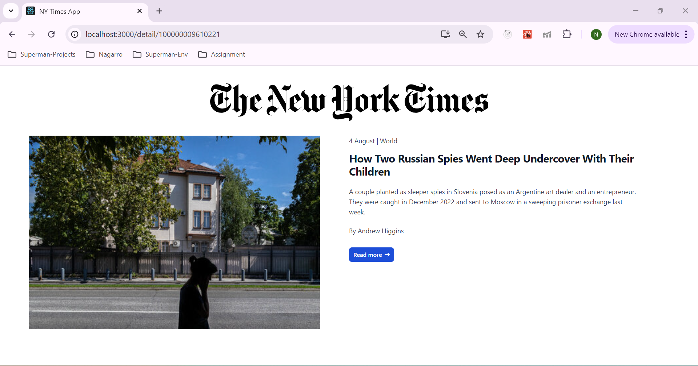

## The New York Times App 

The New York Times app which show the list of Most Popular NY articles and on click of
article it will take user to detail page of the article.

### `Home Page`

### `Article Detail Page`

## Technical Stack

* ReactJs
* TypeScript
* Axios
* JEST
* TestingLibrary/react
* Cypress

## Version Used

### yarn - 1.22.15
### node - 20.12.0
### npm - 10.5.0

## Available Scripts

In the project directory, you can run:

### `yarn`

To install all the project related packages from package.json. It will create a yarn.lock 
file in you project 

### `yarn start`

Runs the app in the development mode.\
Open [http://localhost:3000](http://localhost:3000) to view it in browser.

The page will reload when you make changes.
You may also see any lint errors in the console.

### `yarn test`

Launches the test runner in the interactive watch mode.
You can find the coverage report in coverage package coverage/icov-report/index.html

### `yarn build`
 
Builds the app for production to the `build` folder.\
It correctly bundles React in production mode and optimizes the build for the best performance.

The build is minified and the filenames include the hashes.\
Your app is ready to be deployed!

## For Mac / Windows

In package.json for building the project use

###  "start": "react-scripts start",
###  "build": "react-scripts build",

## Cypress E2E testing

### yarn cypress open 

It will open cypress window and cofigure some steps to add it into you code 
After writing cypress test cases. In that window it will execute the test cases.

## React Test cases

### yarn test

